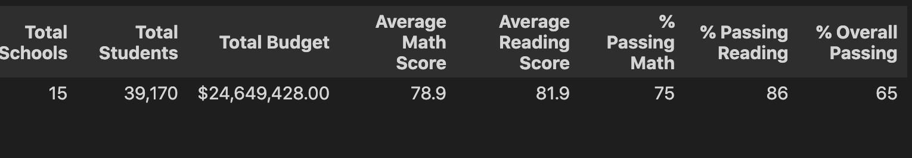

# School District Analysis


## Overview

Previously, we analyzed the student performance and funding of various schools. The results were very informative as we got to see the average scores by grade, school type, school size, etc. However, we need to repeat the process as we were informed that some of the data is invalid as some grades seem to be altered.


## Tools and Requirements

`Python 3.7.13`

    numpy==1.21.6
    pandas==1.3.5
    pytest==7.1.2


## Results

The District Summary was not heavily affected by the missing data. We replaced all of the scores of the 9th grade of Thomas High School with `NaN` values. Even after that, the averages and percentages by school types, sizes and spending changed by 1% or less.



In our previous analysis, the Average Math Score was `79`. The rest of the values, once formatted, stay the same. However, the School Summary was most noticeably affected.

We can create a few tests to compare both DataFrames.

```python
# from PyCitySchools_test.py
def compare_dataframes(original: pd.DataFrame, modified: pd.DataFrame):
    """Substract modified DF from original.
    Check that the values in the difference are smaller than 1%."""
    assert original.size == modified.size
    difference = original - modified
    for col_diff, col in zip(difference, original):
        for val_diff, val in zip(difference[col_diff], original[col]):
            ratio = abs(val_diff / val)
            assert ratio < 0.01
            if ratio != 0:
                msg = f"{col_diff} DIFFERENCE: {100*ratio:.2f}%"
                log.info(msg)
    log.info(difference)
```

This is an example of the test results. Where we expect the changes not to be larger than 1%, which is an arbitrary value based on observation. If it was higher, we should check that we didn&rsquo;t alter more of the data by mistake. 


### Thomas High School Difference

A positive value means the that original result had a higher score.

|                    | AverageMathScore | AverageReadingScore | %PassingMath | %PassingReading | %OverallPassing |
|------------------ |---------------- |------------------- |------------ |--------------- |--------------- |
| Thomas High School | 0.067412         | -0.047152           | 0.086481     | 0.290129        | 0.317689        |

We can suspect that the original Thomas High School 9th grade scores were curved to help more students pass the classes. The difference is very small, however, when comparing the rankings of each school by all columns, we found two problems.

```org
Thomas High School rank moved from 4 to 6 in Average Math Score.
Thomas High School rank moved from 1 to 3 in % Passing Reading.
```

This is the code we can use to find the ranking differences.

```python
# from PyCitySchools_test.py
def test_ths_ranks(complete_parameters: dict, modified_parameters: dict):
    """Find if Thomas High School rank amongst other schools changed."""
    original_df = pd.DataFrame(complete_parameters)
    modified_df = pd.DataFrame(modified_parameters)
    size = complete_parameters["Average Math Score"].size
    rank_difference = pd.DataFrame()
    for category in complete_parameters:
        original = original_df.sort_values(by=category, ascending=False)
        modified = modified_df.sort_values(by=category, ascending=False)
        original["rank"] = range(1, size + 1)
        modified["rank"] = range(1, size + 1)
        original_rank = original.loc[original.index == "Thomas High School", "rank"]
        modified_rank = modified.loc[modified.index == "Thomas High School", "rank"]
        rank_shift = original_rank - modified_rank
        if rank_shift.values[0] != 0:
            log.info(
f"""Thomas High School rank moved from {original_rank.values[0]} to {modified_rank.values[0]} in {category}."""
            )
        rank_difference[category] = rank_shift

    rank_difference.index.name = ""
    log.info(rank_difference)
```

A negative value means that the original result had the school ranked higher.

|                    | AverageMathScore | AverageReadingScore | %PassingMath | %PassingReading | %OverallPassing |
|------------------ |---------------- |------------------- |------------ |--------------- |--------------- |
| Thomas High School | -2               | 0                   | 0            | -2              | 0               |

This tells us that, in the original data, Thomas High School was `#1` in `%PassingReading` and `Top 5` in `AverageMathScore`. This is probably the most relevant change in the analysis.

Ranking of Original % Passing Reading

|                        | % Passing Reading | rank  |
|---------------------- |----------------- |----- |
| **Thomas High School** | **97.308869**     | **1** |
| Griffin High School    | 97.138965         | 2     |
| Cabrera High School    | 97.039828         | 3     |
| Wright High School     | 96.611111         | 4     |
| Wilson High School     | 96.539641         | 5     |

Ranking of Modified % Passing Reading

|                        | % Passing Reading | rank  |
|---------------------- |----------------- |----- |
| Griffin High School    | 97.138965         | 1     |
| Cabrera High School    | 97.039828         | 2     |
| **Thomas High School** | **97.018739**     | **3** |
| Wright High School     | 96.611111         | 4     |
| Wilson High School     | 96.539641         | 5     |

Now that we have the code to find the differences in the results, we can explore the rest of the School Analysis parts for sake of completion. Positive values mean that the original results were higher.


### Difference of Scores by School Spending

| SchoolSpending | AverageMathScore | AverageReadingScore | %PassingMath | %PassingReading | %OverallPassing |
|-------------- |---------------- |------------------- |------------ |--------------- |--------------- |
| <$586          | 0.000000         | 0.000000            | 0.00000      | 0.000000        | 0.000000        |
| $586-630       | 0.000000         | 0.000000            | 0.00000      | 0.000000        | 0.000000        |
| $631-645       | 0.016853         | -0.011788           | 0.02162      | 0.072532        | 0.079422        |
| $646-675       | 0.000000         | 0.000000            | 0.00000      | 0.000000        | 0.000000        |


### Difference of Scores by School Size

| SchoolSize          | AverageMathScore | AverageReadingScore | %PassingMath | %PassingReading | %OverallPassing |
|------------------- |---------------- |------------------- |------------ |--------------- |--------------- |
| Small   (<1000)     | 0.000000         | 0.00000             | 0.000000     | 0.000000        | 0.000000        |
| Medium  (1000-1999) | 0.013482         | -0.00943            | 0.017296     | 0.058026        | 0.063538        |
| Large   (2000-5000) | 0.000000         | 0.00000             | 0.000000     | 0.000000        | 0.000000        |


### Difference of Scores by School Type

| SchoolType | AverageMathScore | AverageReadingScore | %PassingMath | %PassingReading | %OverallPassing |
|---------- |---------------- |------------------- |------------ |--------------- |--------------- |
| Charter    | 0.008426         | -0.005894           | 0.01081      | 0.036266        | 0.039711        |
| District   | 0.000000         | 0.000000            | 0.00000      | 0.000000        | 0.000000        |


### Difference of Math and Reading scores by grade

We can&rsquo;t compare the 9th grade row in the same way as we can compare the rest of the analysis results. If we try to use Python to make a judgment, we will probably run into an error as we could not compare `NaN` to a `float` like with other tests.

```python
assert abs(value_modified / value_original) < 0.01
```

```org
>       assert abs(value_modified / value_original) < 0.01
E       assert nan < 0.01

PyCitySchools_test.py:159: AssertionError
```


## Summary

1.  The biggest difference was that Thomas High School was Ranked `#1` in Passing Reading Percentage before removing the data, and moved to `#3` once we replaced the scores with `NaN`.
2.  Another important change was that Thomas High School was `Top 5` in Average Math Score before removing the data, and moved to `#6` once we replaced the scores with `NaN`. What is most interesting is that the Overall Percentage didn&rsquo;t change that much, as we saw increases in both reading and math scores. We can assume that the curve applied to the reading scores helped mostly the students that didn&rsquo;t pass the class initially.
3.  The whole District Average Math Score decreased by `1%` after removing the data, some of it can be the formatting of the data to string as the rest of the values that we inspected more closely had changes under 1%, which in this case was an arbitrary parameter for testing that the differences wouldn&rsquo;t be too big.
4.  The School Summary was not heavily affected as the schools are shown individually, however, Thomas High School affects the Binned results because it is grouped with the rest of the `Charter`, `Medium Sized` and `$631-645` groups.


## Closing Thoughts

Thanks to Python and Pandas we were able to process the data once more in a streamlined way. We can also run as many transformations, comparisons and tests with our DataFrames as we want. The possibility of doing so programmatically gives us more time to group and separate the results and can give us answers that help us make decisions.
